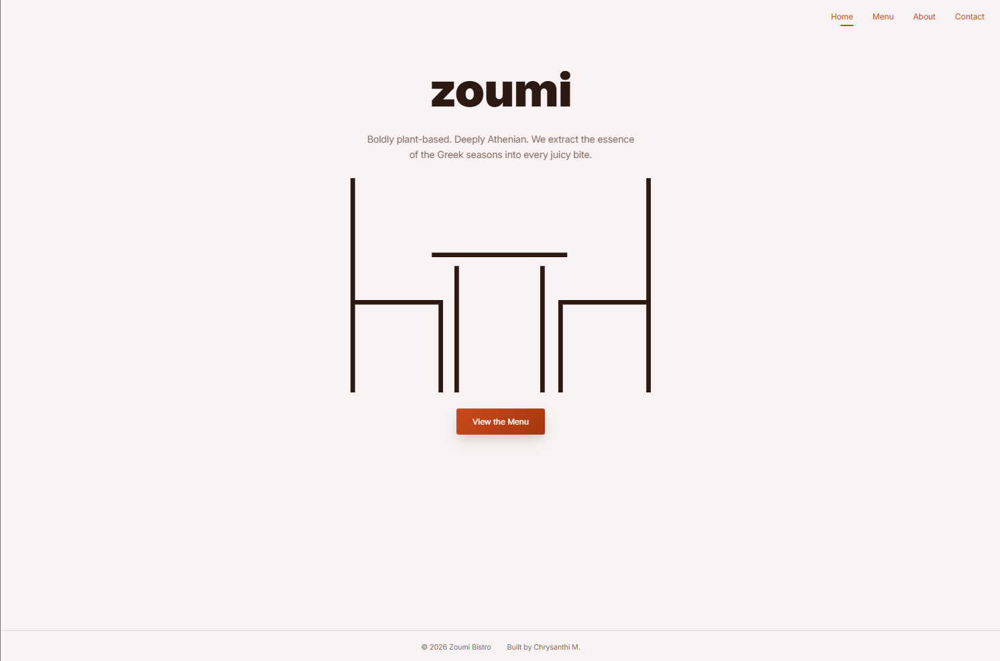

# Zoumi Bistro - SPA Restaurant Page

**Zoumi Bistro** is a high-performance, responsive Single Page Application (SPA) built as part of The Odin Project curriculum. This project moves away from traditional multi-page architecture, using vanilla JavaScript and Webpack to dynamically manage the DOM.

[🌐 View Live Demo](https://cmatsagka.github.io/restaurant-page/)



---

## 🌟 The Challenge & Architecture

The core requirement was to build a restaurant site where the entire content is generated via JavaScript, mastering **ES6 modules**, **Webpack bundling**, and **dynamic DOM manipulation** without relying on multiple static HTML files.

### Advanced "Professional" Polish Features:

1. **Modular "Helper" Architecture:** Keeps code DRY by avoiding repetitive `document.createElement` calls, making it easy to scale menu items and sections.
2. **Navigation "Flex-Wrap" Strategy:** Avoids traditional mobile burger menus in favor of a centered, thumb-friendly flex-wrap layout to reduce user interaction costs.
3. **The "Animation Reset" Trick:** Implements a DOM reflow technique (`content.offsetHeight`) ensuring page transitions fade in smoothly every time a tab is clicked.
4. **State-Aware UI:** Manages active tab state dynamically, preventing confusing UI feedback on mobile devices.

---

## 🛠️ Tech Stack & Tooling

- **Markup & Styling:** Semantic HTML5 generation via JS, modern CSS3 featuring **CSS Variables** for a unified color palette and theming.
- **Logic & Bundling:** Vanilla JavaScript (ES6 modules), **Webpack** for module bundling and CSS/asset processing.

---

## 🚀 Quick Start

Clone the repository:

```bash
git clone git@github.com:cmatsagka/restaurant-page.git
```

Clone the repository:

```bash
git clone git@github.com:cmatsagka/restaurant-page.git
```

Open the project directory:

```bash
cd restaurant-page
```

Install dependencies:

```bash
npm install
```

Start the development server:

```bash
npm start
```
